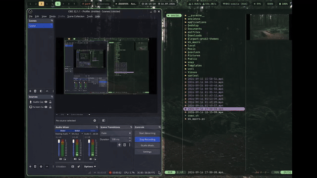

# veil

a lockscreen for niri/wayland on ext-session-lock-v1: python + pywayland,
frames rendered with pillow, password checked via PAM. the session is held
by the compositor, so Ctrl+C and kill won't help. if the process dies while
locked, you'll have to unlock from a TTY (see below).

on screen: ascii art, clock, cpu/ram and a fake "audit" at the bottom. just
because it looks cool. gruvbox palette.

## install

    ./install.sh

the script puts everything into ~/.local/share/veil (venv, protocol bindings
from xml/), launcher goes to ~/.local/bin/veil-lock. bind in niri:

    Mod+Shift+V { spawn "/home/anaidyss/.local/bin/veil-lock"; }

needs: python3, JetBrainsMono Nerd Font in ~/.local/share/fonts
(Regular and Bold ttf).

## how it works

- all setup (globals, fonts, pre-render) happens strictly before lock()
- right after lock(): get_lock_surface for each output, frames via shm/memfd
- `locked` only arrives after the frames are presented
- unlock_and_destroy only after locked, otherwise invalid_unlock and a
  maroon screen
- emergency exit without a reboot: Ctrl+Alt+F3, log into a TTY, then
  `XDG_RUNTIME_DIR=/run/user/1000 WAYLAND_DISPLAY=wayland-1 hyprlock`

protocol bindings are not in the repo, install.sh generates them:

    venv/bin/python -m pywayland.scanner -i xml/wayland.xml xml/ext-session-lock-v1.xml -o protocols

## veil_ui.py

the old version: a textual TUI for a regular terminal (not a real lockscreen,
tty only). deps: python3-textual python3-psutil python3-pam, run directly.
